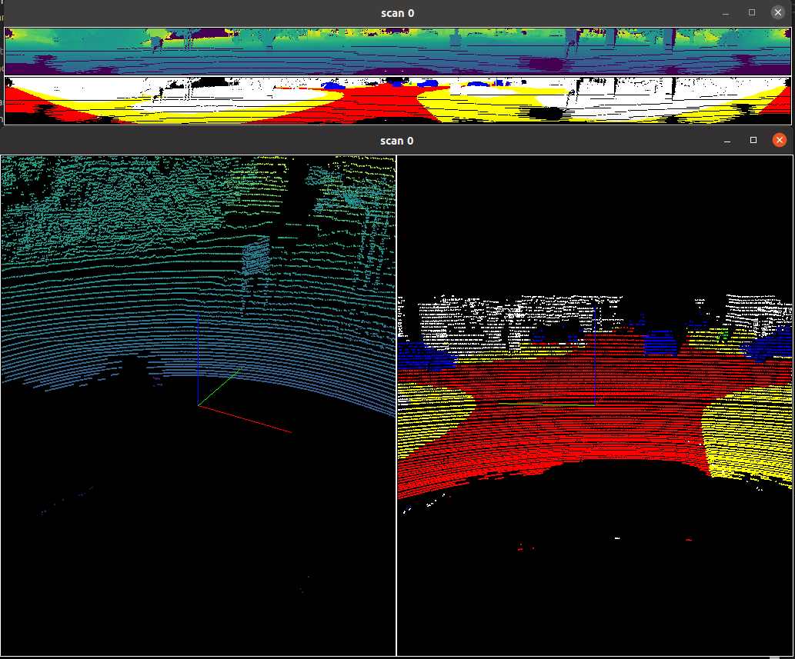

# semantic-kitti-api 개량
### 내용
- 개인 프로젝트의 필요에 맞춰 내용을 수정
- 실행 옵션을 추가하여 [x, y, z, intensity, label] 형태의 데이터 처리 가능
- semantic segmentation 된 결과를 확인하기 위한 도구
- 학습 결과에 맞춰 색상 표현 변경

### 참조
- [semantic-kitti-api](https://github.com/PRBonn/semantic-kitti-api)

### 환경
- Unbuntu 20.04 LTS
- CUDA : 11.2
- NVIDIA 드라이버 : 470.256.

### build
``` bash
pip3 install matplotlib vispy torch numpy PyYAML "imgui[glfw]" glfw PyOpenGL
sudo apt install build-essential libgl1-mesa-dev libxkbcommon-x11-0
pip3 install PyQt5-Qt5==5.15.2
pip3 install PyQt5==5.15.4
```

### 파일 구조
- config 파일 및 실행 옵션에 따라 파일 구성
- config/ 파일 참조
```
/lidar_data_path
    ├── 00/
    │   ├── velodyne/
    │   │   ├ 000000.bin
    │   │   └ 000001.bin
    │   └── labels/
    │        ├ 000000.label
    │        └ 000001.label
    ├── 01/
    │   ├── ouster/
    │   │   ├ 000000.bin
    │   │   └ 000001.bin
    ├── 02/
```

### 실행
``` bash
# [x, y, z, intensity, label] 데이터 형식
./visualize.py -d {sequence 번호 경로} --combined

# [x, y, z, intensity] 데이터 형식
./visualize.py -d {sequence 번호 경로} --combined

# config 파일의 label_map 사용
## 원본 label 대신, 보고 싶은 label만 시각화할 때 사용
./visualize.py -d {sequence 번호 경로} --mapping
```

- 사용법
  - n: 다음 스캔
  - b: 이전 스캔
  - esc 또는 q: 종료

### 결과
- 흰색 : unlabeled
- 빨강색 : road
- 노랑색 : side-walk
- 파랑색 : car
- 초록색 : other-vehicle
  
